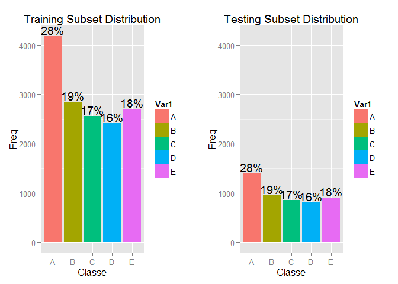
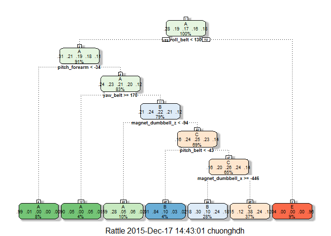

# Practical Machine Learning Course Project
Chuong Hoang  
Monday, Dec 14, 2015  

## I. Abstract:

The purpose of this study is to build a machine learning model helping to predict the manner of barbell lifts. Based on Weight Lifting Exercises (WLE) Dataset, author will evaluate the most approriate model between two well known supervised learning methods are **Decision Tree** and **Random Forest**. Applying **Cross-validation** approach, the Random Forest reveal the significant better result with **99.2% accuracy** and **0.8% out-of-sample error** comparring to Decision Tree. The selected model will exercise on testing dataset for final evaluation.

## II. Introduction:

**Background**

Using devices such as Jawbone Up, Nike FuelBand, and Fitbit it is now possible to collect a large amount of data about personal activity relatively inexpensively. These type of devices are part of the quantified self movement. In this study, the goal will be to use data from accelerometers on the belt, forearm, arm, and dumbell of 6 participants who were asked to perform barbell lifts correctly and incorrectly in 5 different ways. Returning values of each observation were labeled corresponding to 5 categorized fashions[1]:

* Class A - exactly according to the specification 
* Class B - throwing the elbows to the front 
* Class C - lifting the dumbbell only halfway 
* Class D - lowering the dumbbell only halfway 
* Class E - throwing the hips to the front

**Data Sources**

The data for this project come from this source: [http://groupware.les.inf.puc-rio.br/har].

* The training data for this project are available here: [https://d396qusza40orc.cloudfront.net/predmachlearn/pml-training.csv]
* The test data are available here: [https://d396qusza40orc.cloudfront.net/predmachlearn/pml-testing.csv]

**Machine Learning Methods Using**

The nature of this study is Suppervised Learning which can be solved by many different methods such as: Decision trees, Naive Bayes, Logistic regression, Random Forests... But in the contrainst of time and project requirement, author only take into consider two methods are: Decision Tree and Random Forests.

**Cross Validation**

k-Folder Cross Validation method with k=5 will apply for this study. By this way each learning methods will be built and validated 5 times with different sub-training and sub-testing pairs. 

**Result Evaluation**

The learning model evaluation is based on 2 figures: **accuracy** and **expected out-of-sample error**. The selected model, which has lowest expected out-of-sample error will be used for final judgement on testing dataset.


## III. Method:

### Used Packages

The research use 4 libraries with following descriptions:

* *caret* - Set of functions that attempt to streamline the process for creating predictive models
* *randomForest* - Classification and regression library based on Random Forest Method
* *rpart* - Regressive Partitioning and Regression trees
* *rpart.plot* - Plotting decision tree
* *gridExtra* - Laying out plots


```r
library(caret)        
library(randomForest) #Random Forest Method
library(rpart)        #Decision Tree Method
library(rattle)       #Plotting Decision Tree
library(gridExtra)    #Laying out plot

# set seed for reproducible results
set.seed(1000)
```

### Data Preparation

**Getting and Cleanning Data**

Load training and testing datasets from HAR-WLE source and do some quick exploration.

```r
# Load the training data set and replace missing values with "NA"
trainingset <- read.csv("pml-training.csv", na.strings=c("NA","#DIV/0!", ""))

# Load the testing data set and replace missing values with "NA"
testingset <- read.csv('pml-testing.csv', na.strings=c("NA","#DIV/0!", ""))

# apply some quick exploration
dim(trainingset)
```

```
## [1] 19622   160
```

```r
dim(testingset)
```

```
## [1]  20 160
```

```r
str(trainingset, list.len=20)
```

```
## 'data.frame':	19622 obs. of  160 variables:
##  $ X                       : int  1 2 3 4 5 6 7 8 9 10 ...
##  $ user_name               : Factor w/ 6 levels "adelmo","carlitos",..: 2 2 2 2 2 2 2 2 2 2 ...
##  $ raw_timestamp_part_1    : int  1323084231 1323084231 1323084231 1323084232 1323084232 1323084232 1323084232 1323084232 1323084232 1323084232 ...
##  $ raw_timestamp_part_2    : int  788290 808298 820366 120339 196328 304277 368296 440390 484323 484434 ...
##  $ cvtd_timestamp          : Factor w/ 20 levels "02/12/2011 13:32",..: 9 9 9 9 9 9 9 9 9 9 ...
##  $ new_window              : Factor w/ 2 levels "no","yes": 1 1 1 1 1 1 1 1 1 1 ...
##  $ num_window              : int  11 11 11 12 12 12 12 12 12 12 ...
##  $ roll_belt               : num  1.41 1.41 1.42 1.48 1.48 1.45 1.42 1.42 1.43 1.45 ...
##  $ pitch_belt              : num  8.07 8.07 8.07 8.05 8.07 8.06 8.09 8.13 8.16 8.17 ...
##  $ yaw_belt                : num  -94.4 -94.4 -94.4 -94.4 -94.4 -94.4 -94.4 -94.4 -94.4 -94.4 ...
##  $ total_accel_belt        : int  3 3 3 3 3 3 3 3 3 3 ...
##  $ kurtosis_roll_belt      : num  NA NA NA NA NA NA NA NA NA NA ...
##  $ kurtosis_picth_belt     : num  NA NA NA NA NA NA NA NA NA NA ...
##  $ kurtosis_yaw_belt       : logi  NA NA NA NA NA NA ...
##  $ skewness_roll_belt      : num  NA NA NA NA NA NA NA NA NA NA ...
##  $ skewness_roll_belt.1    : num  NA NA NA NA NA NA NA NA NA NA ...
##  $ skewness_yaw_belt       : logi  NA NA NA NA NA NA ...
##  $ max_roll_belt           : num  NA NA NA NA NA NA NA NA NA NA ...
##  $ max_picth_belt          : int  NA NA NA NA NA NA NA NA NA NA ...
##  $ max_yaw_belt            : num  NA NA NA NA NA NA NA NA NA NA ...
##   [list output truncated]
```

After some quick exporation, noticing that:  

* Columns from 1 to 7 maintain additional info about user, timestamps and windows which are not relevant as the input variables. Those can be remove from data sets.
* A number of factors do not have any value with all "NA" values. Those can be remove from data sets. 


```r
# Remove columns from 1 to 7 due to irrelevant values
trainingset <- trainingset[,-c(1:7)]
testingset <- testingset[,-c(1:7)]

# Study how many factors that not having any value, remember to discard the last factor "classe" to be able to run sum function
sum_each_factor <- sapply(trainingset[,-length(trainingset)],sum)
sum(is.na(sum_each_factor))
```

```
## [1] 100
```

```r
# Remove all not available factors
trainingset <- trainingset[,!is.na(sum_each_factor)]
testingset <- testingset[,!is.na(sum_each_factor)]
```

**Partitioning Data**

Understand that the testing dataset provided by WLE is for final judgment purpose. moreover with only 20 observations without clasification, this dataset is not adequate to validate the predictive model. Therefore partitioning initial training dataset into subsets is neccessary for model development.

in this research, author devide the initial training dataset into 2 sub-sets with proportion of 75%. 


```r
# Create 75% in training subset index
inTrain <- createDataPartition(y = trainingset$classe, p = .75, list = FALSE)

# Create training subset and testing subset
training_subset <- trainingset[inTrain, ]
testing_subset <- trainingset[-inTrain, ]
```

**Explorating Data Sets**

Before starting the predictive modeling, we should take a look into the distribution of classe levels in two subsets to ensure they have a balance distribution. Thus the partitions are suitable for modeling.


```r
# Examine training subset distribution in Frequency and Proportion
training_dist <- data.frame(table(training_subset$classe))
training_dist <- data.frame(training_dist, Prop = round(training_dist$Freq/sum(training_dist$Freq),2))

# Examine testing subset distribution in Frequency and Proportion
testing_dist <- data.frame(table(testing_subset$classe))
testing_dist <- data.frame(testing_dist, Prop = round(testing_dist$Freq/sum(testing_dist$Freq),2))

# Create density plot demonstrate training subset
training_plot <- ggplot(training_dist,aes(x=Var1, y=Freq, fill=Var1)) + 
  geom_bar(stat="identity") + ggtitle("Training Subset Distribution") + xlab("Classe") +
  geom_text(aes(label=c(paste(Prop*100,"%",sep=""))),vjust=-.2) 

# Create density plot demonstrate testing subset
testing_plot <- ggplot(testing_dist,aes(x=Var1, y=Freq, fill=Var1)) + 
  geom_bar(stat="identity") + ggtitle("Testing Subset Distribution") + xlab("Classe") + 
  geom_text(aes(label=c(paste(Prop*100,"%",sep=""))),vjust=-.2) + expand_limits(y=c(0,max(training_dist$Freq)))

grid.arrange(training_plot, testing_plot, ncol=2)
```

 

As we can see the distribution of classe after partitioning into training and testing subsets is equal, thus those subsets are affordable for modeling. 

### Predictive Modeling

**Cross Validation Approach**

k-Folder Cross Validation method with k=5 will apply for this study. 


```r
# Define training control option in cross validation method with 5 folders
fitControl = trainControl(method = "cv", number = 5)
```

**Decision Tree Method**

Modeling with decision tree method


```r
# Build model based on training subset
model_Rpart <- train(classe~., method="rpart", data=training_subset)

# Plot of the Decision Tree
fancyRpartPlot(model_Rpart$finalModel)
```

 

```r
# Apply model to testing subset
pred_Rpart <- predict(model_Rpart,testing_subset)

# Display the predicting results
confusionMatrix(pred_Rpart, testing_subset$classe)
```

```
## Confusion Matrix and Statistics
## 
##           Reference
## Prediction   A   B   C   D   E
##          A 837 144  21  37  11
##          B 252 586 161 347 252
##          C 283 219 673 420 222
##          D   0   0   0   0   0
##          E  23   0   0   0 416
## 
## Overall Statistics
##                                           
##                Accuracy : 0.5122          
##                  95% CI : (0.4981, 0.5263)
##     No Information Rate : 0.2845          
##     P-Value [Acc > NIR] : < 2.2e-16       
##                                           
##                   Kappa : 0.3865          
##  Mcnemar's Test P-Value : NA              
## 
## Statistics by Class:
## 
##                      Class: A Class: B Class: C Class: D Class: E
## Sensitivity            0.6000   0.6175   0.7871   0.0000  0.46171
## Specificity            0.9393   0.7441   0.7175   1.0000  0.99425
## Pos Pred Value         0.7971   0.3667   0.3704      NaN  0.94761
## Neg Pred Value         0.8552   0.8902   0.9410   0.8361  0.89138
## Prevalence             0.2845   0.1935   0.1743   0.1639  0.18373
## Detection Rate         0.1707   0.1195   0.1372   0.0000  0.08483
## Detection Prevalence   0.2141   0.3259   0.3705   0.0000  0.08952
## Balanced Accuracy      0.7696   0.6808   0.7523   0.5000  0.72798
```

Decision tree model results on training subset:

* accuracy = 51.2 %
* expected out-of-sample error = 48.8 %

**Random Forest Method**

Modeling with Random Forest method


```r
# Build model based on training subset
model_Rforest <- train(classe~., method="rf",trControl = fitControl, data=training_subset)

# Apply model to testing subset
pred_Rforest <- predict(model_Rforest,testing_subset)

# Display the predicting results
confusionMatrix(pred_Rforest, testing_subset$classe)
```

```
## Confusion Matrix and Statistics
## 
##           Reference
## Prediction    A    B    C    D    E
##          A 1392    4    0    0    0
##          B    3  944    5    0    0
##          C    0    1  840    5    0
##          D    0    0   10  796    6
##          E    0    0    0    3  895
## 
## Overall Statistics
##                                           
##                Accuracy : 0.9925          
##                  95% CI : (0.9896, 0.9947)
##     No Information Rate : 0.2845          
##     P-Value [Acc > NIR] : < 2.2e-16       
##                                           
##                   Kappa : 0.9905          
##  Mcnemar's Test P-Value : NA              
## 
## Statistics by Class:
## 
##                      Class: A Class: B Class: C Class: D Class: E
## Sensitivity            0.9978   0.9947   0.9825   0.9900   0.9933
## Specificity            0.9989   0.9980   0.9985   0.9961   0.9993
## Pos Pred Value         0.9971   0.9916   0.9929   0.9803   0.9967
## Neg Pred Value         0.9991   0.9987   0.9963   0.9980   0.9985
## Prevalence             0.2845   0.1935   0.1743   0.1639   0.1837
## Detection Rate         0.2838   0.1925   0.1713   0.1623   0.1825
## Detection Prevalence   0.2847   0.1941   0.1725   0.1656   0.1831
## Balanced Accuracy      0.9984   0.9964   0.9905   0.9931   0.9963
```

Random Forest model results on training subset:

* accuracy = 99.2 % 
* expected out-of-sample error = 0.8 %

## IV. Conclusion:

Comparring results from 2 models we can see that Random Forest model return higher accuracy rate than Decision Tree. As the consequence the expected out-of-sample error of Random Forest model is much more lower than Decision Tree one. 0.8 % comparring to 48.8 %.

With these measurable figures author can conclude that the Random Forest model is sufficient for deployment.We then will use the selected model to predict the classe of each observation in initial testing set.


```r
answers <- predict(model_Rforest,testingset)
answers
```

```
##  [1] B A B A A E D B A A B C B A E E A B B B
## Levels: A B C D E
```

## V. Course Submission:

Create twenty .TXT file that we will upload one by one in the Coursera website (the 20 files created are called problem_1.txt to problem_20.txt):


```r
pml_write_files = function(x){
  n = length(x)
  for(i in 1:n){
    filename = paste0("problem_id_",i,".txt")
    write.table(x[i],file=filename,quote=FALSE,row.names=FALSE,col.names=FALSE)
  }
}

pml_write_files(answers)
```

## *Literature Cited:*
[1] http://groupware.les.inf.puc-rio.br/har#ixzz3uHkurQ3x Human Activity Recognition - Weight Lifting Exercises Dataset


